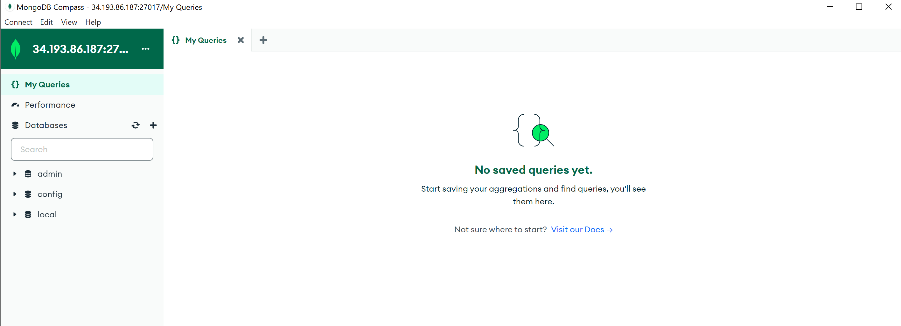
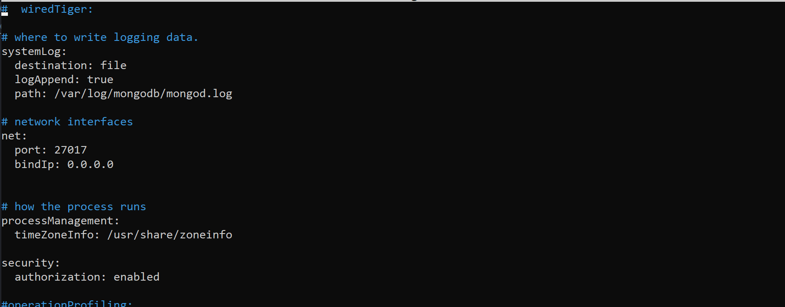
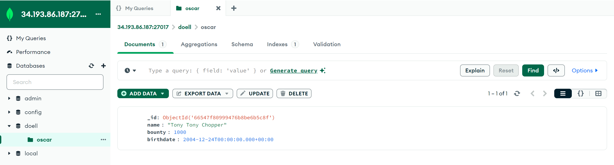
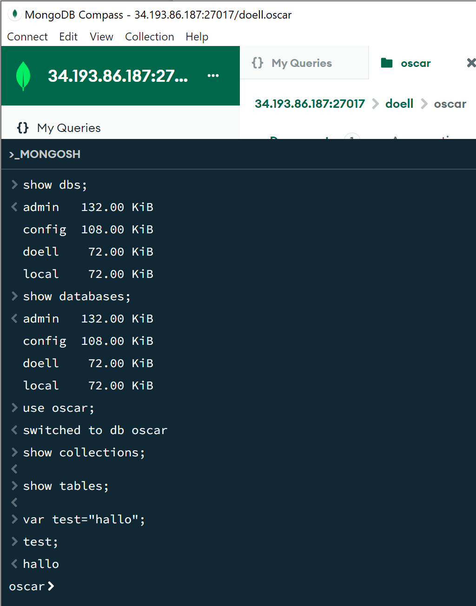
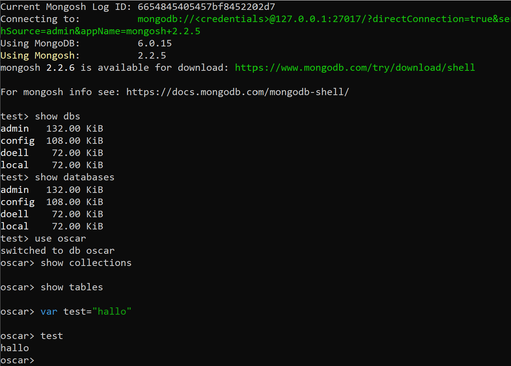

# KN01
## A
[cloud init](https://github.com/oscar-doell/m165/blob/main/cloudinit-mongodb.yaml) \

authSource=admin:

Dieser Parameter gibt an, welche Datenbank zur Authentifizierung des Benutzers verwendet wird. In diesem Fall wird die admin-Datenbank verwendet.
MongoDB ermöglicht es, Benutzer in verschiedenen Datenbanken zu speichern. Standardmäßig werden Benutzer in der admin-Datenbank gespeichert, aber sie können auch in anderen Datenbanken gespeichert werden.
Wenn Sie sich mit einem Benutzer anmelden, der in einer anderen Datenbank als der, mit der Sie sich verbinden möchten, gespeichert ist, müssen Sie authSource verwenden, um die Authentifizierungsdatenbank anzugeben.

sed -i 's/#security:/security:\n authorization: enabled/g':

- sed: Stream Editor, ein Unix-Werkzeug zur Manipulation von Textströmen oder Dateien.
- -i: Steht für "in-place" und bedeutet, dass die Datei direkt bearbeitet wird, ohne dass eine temporäre Datei erstellt wird.
- 's/#security:/security:\n authorization: enabled/g': Ist der eigentliche Such-und-Ersetz-Befehl:
- s/: Signalisiert den Beginn eines Such-und-Ersetz-Musters.
- #security:: Die zu suchende Zeichenkette. Das # zeigt an, dass die Zeile kommentiert ist.
- /security:\n authorization: enabled/: Die zu ersetzende Zeichenkette. Die \n steht für einen Zeilenumbruch, und die zwei Leerzeichen nach authorization: dienen der korrekten Einrückung im YAML-Format.
- /g: Steht für "global" und bedeutet, dass alle Vorkommen des Musters in der Datei ersetzt werden.
- /etc/mongod.conf: Pfad zur MongoDB-Konfigurationsdatei.

Die zweite anwendung von sed ist eigentlich das gleiche. Es werden aber andere optionen ersetzt.

Der erste Befehl ermöglicht die Verbindung zur Datenbank von jeder IP.
Der zweite Befehl aktiviert die Authifiierung, was das Eingeben eines Passwort erzwingt.

## B

[export](https://github.com/oscar-doell/m165/blob/main/doell.oscar.json)
Das Datum wird so gesetzt indem ein $date vor dem Wert gesetzt wird.

## C

1. Zeigt alle datenbanken an.
2. Zeigt alle datenbanken an.
3. Wechselt in die Collection "oscar".
4. Zeigt alle collections in oscar an.
5. Gleich wie show collections.
