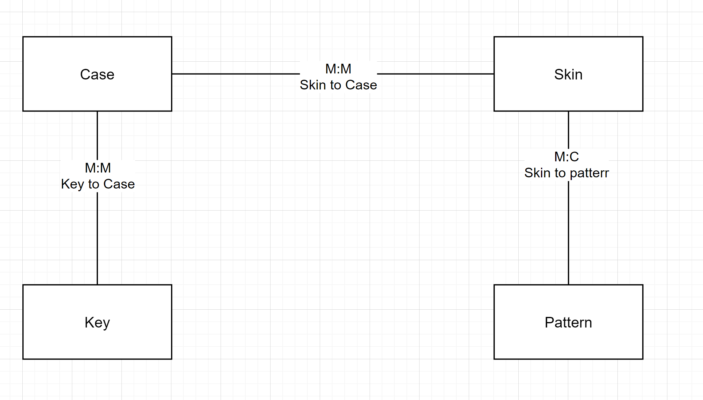
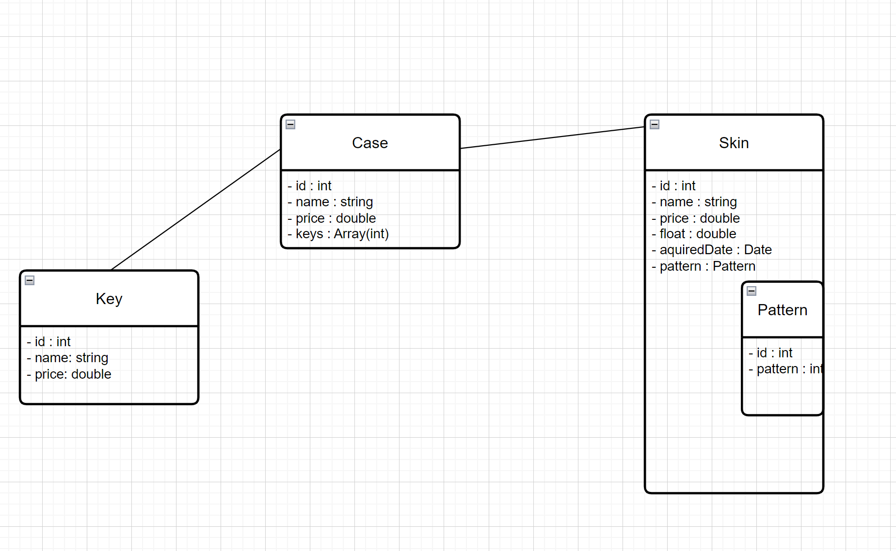

# KN02
## A

[drawio]()

Key: Ein key wird verwendet um ein Case zu öffnen. 1 case kann von mehreren keys geöffnet und 1 key kann mehrere cases öffnen.
Case: Ein case enthält mehrere skins. Einzelne skins können auch in verschiedene cases vorkommen.
Skin: Manche skins haben einen pattern. Ein pattern kann auf mehreren skins vorkommen.
## B

[drawio]()

Ich habe Pattern und skin als verschachtelung genommen, da die M:C verbindung ideal ist dafür. 

## C
[script]()
