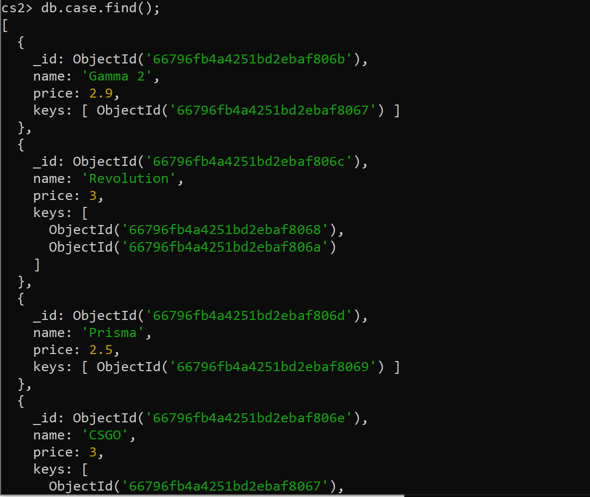
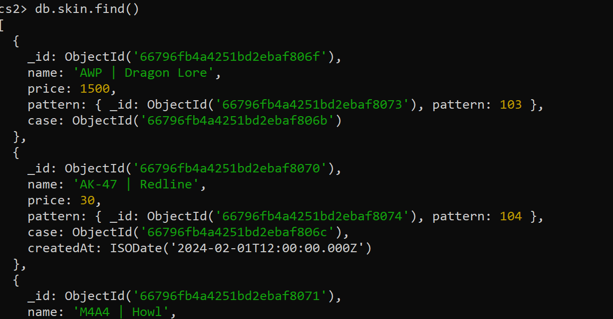

# KN05

## A

[script](https://github.com/oscar-doell/m165/blob/main/KN05_A_script.js)

## B
### 1ste Methode

### 2te Methode

## C
Replikation:
Replikation bezieht sich auf das Duplizieren von Daten auf mehrere Server oder das Erstellen von Replikasätzen, um hohe Verfügbarkeit und Datenredundanz sicherzustellen. Wenn ein Server ausfällt, können die anderen Server weiterhin die aktuellsten Daten bereitstellen.

Quelle: [phoenixnap](https://phoenixnap.com/kb/wp-content/uploads/2021/06/database-replication-full-replication-new.png)

Partitionierung (Sharding):
Sharding ist der Prozess des Aufteilens großer Datenmengen auf mehrere Server, sogenannte Shards. Dadurch werden die Last und der Speicherbedarf gleichmäßig auf die Server verteilt.

Empfehlung an eine Bank:
Situation:
Eine Bank nutzt MongoDB, um Kundendaten, Kontostände und Transaktionshistorien zu speichern und zu verarbeiten. Derzeit läuft die Anwendung auf einem einzelnen MongoDB-Server. Dies kann zu Leistungsengpässen führen und im Falle eines Serverausfalls zu Datenverlust oder Unterbrechungen des Dienstes führen.

Empfehlung:
Ich empfehle der Bank, Replikation als Skalierungsmethode zu verwenden. Dadurch wird sichergestellt, dass bei einem Serverausfall die Kundendaten, Kontostände und Transaktionen weiterhin verfügbar und konsistent sind. So kann der Betrieb der Bankdienste ohne Unterbrechung fortgesetzt werden.
