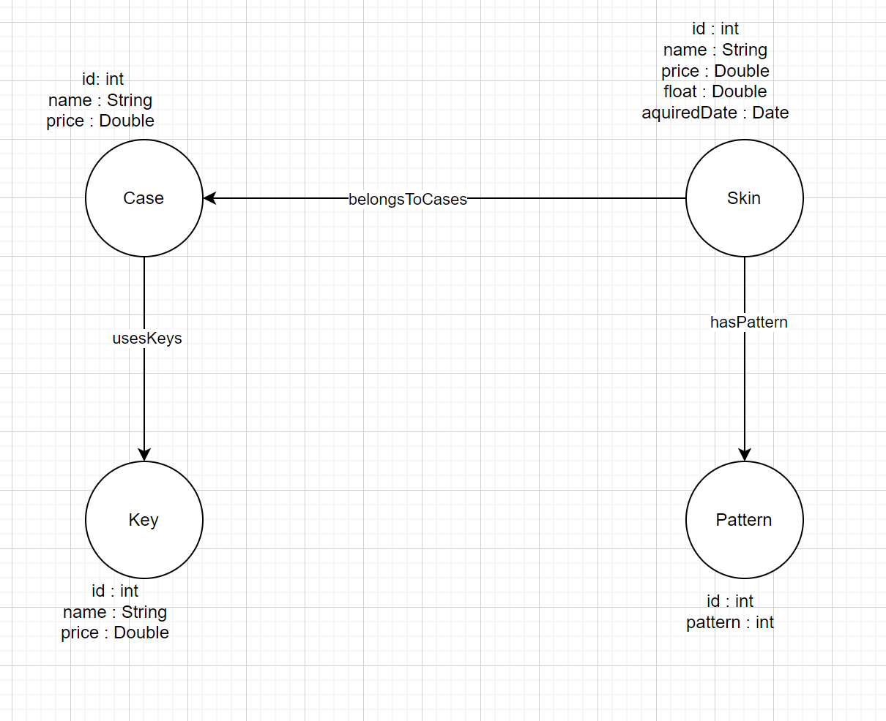

# KN07
## A (mit AWS Instanz)

## B

[drawio]()
 Ich habe eine Ähnliche Logik gebraucht wie bei MongoDB indem ich habe jetzt aber einen Knoten von Skin auf Pattern gemacht statt es in Cases rein zu tun. Der rest ist aber gleich. \
 1 Knoten von Case zu Keys (usesKeys) \
 1 Knoten von Skin zu Cases (belongsToCases) \
 1 Knoten von Case zu Pattern (hasPattern)
