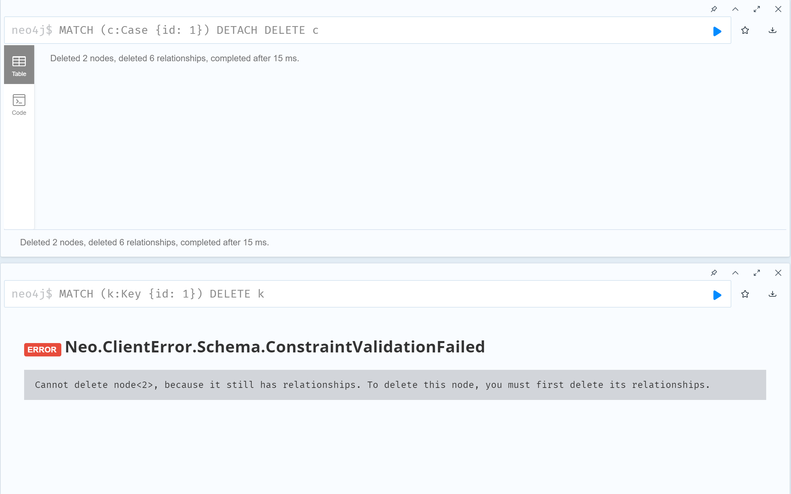
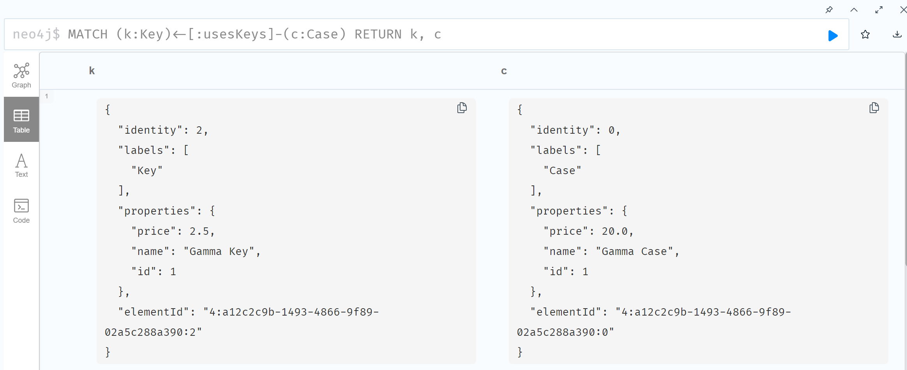
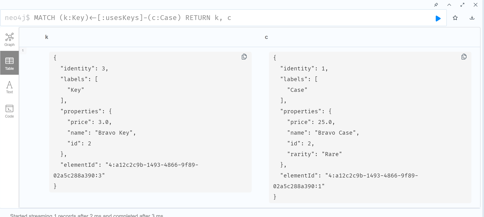

# KN08
## A
[script](https://github.com/oscar-doell/m165/blob/main/KN08_script.txt)
## B
### Erklärung
Das Cypher-Statement MATCH (n) OPTIONAL MATCH (n)-[r]->() RETURN n, r liest alle Knoten (MATCH (n)) und optional alle Kanten, die von diesen Knoten ausgehen (OPTIONAL MATCH (n)-[r]->()). Wenn es keine solchen Kanten gibt, wird trotzdem der Knoten zurückgegeben.
### Szenarien
#### Suche alle Cases und die dazugehörigen Skins:
```cypher
MATCH (c:Case)-[:belongsToCases]->(s:Skin)
RETURN c, s
```
#### Finde alle Skins, die ein bestimmtes Pattern haben:
```cypher
MATCH (s:Skin)-[:hasPattern]->(p:Pattern)
WHERE p.pattern = 123
RETURN s
```
#### Zeige alle Skins, die mit einem bestimmten Preisbereich übereinstimmen:
```cypher
MATCH (s:Skin)
WHERE s.price > 1000 AND s.price < 2000
RETURN s
```
#### Liste alle Keys und die Cases, die sie öffnen:
```cypher
MATCH (k:Key)<-[:usesKeys]-(c:Case)
RETURN k, c
```
## C
```cypher
MATCH (k:Key {id: 1})
DELETE k
```
```cypher
MATCH (c:Case {id: 1})
DETACH DELETE c
```



Man kann nur DELETE ohne DETACH verwenden wenn der Knoten keine Verbindungen hat. DETACH löscht den Knoten und die Verbindungen.
## D
### Szenarien
#### Aktualisiere den Preis eines Skins.
```cypher
MATCH (s:Skin {id: 1})
SET s.price = 1600.0
RETURN s
```
#### Füge ein neues Attribut zu einem Case hinzu.
```cypher
MATCH (c:Case {id: 2})
SET c.rarity = 'Rare'
RETURN c
```
#### Ändere das Pattern eines Skins.
```cypher
MATCH (s:Skin {id: 1})
MATCH (s:Skin {id: 1})-[:hasPattern]->(p:Pattern)
SET p.pattern = 456
RETURN s, p
```
## E
### MERGE
Die MERGE-Klausel versucht, einen Knoten oder eine Beziehung zu erstellen, falls sie nicht existiert. Wenn sie existiert, macht sie nichts.
#### Anwendungsfall
Um sicherzustellen, dass ein bestimmter Fall nur einmal in der Datenbank existiert, können wir MERGE verwenden. Zum Beispiel, wenn wir sicherstellen möchten, dass ein bestimmter Case nur einmal vorhanden ist, egal wie oft das Skript ausgeführt wird:
```cypher
MERGE (c:Case {id: 3, name: 'Chroma Case', price: 30.0})
RETURN c
```
### FOREACH
FOREACH iteriert über eine Sammlung und führt eine Operation für jedes Element der Sammlung aus.
#### Anwendungsfall
Um mehrere Schlüssel zu einem bestehenden Case hinzuzufügen, können wir FOREACH verwenden. Zum Beispiel, wenn wir eine Reihe von Schlüsseln zu einem bestimmten Case hinzufügen möchten:
```cypher
MATCH (c:Case {name: 'Gamma Case'})
FOREACH (x IN [1, 2, 3] | CREATE (c)-[:contains]->(:Key {id: x, name: 'Key ' + x, price: 5.0 * x}))
RETURN c
```
